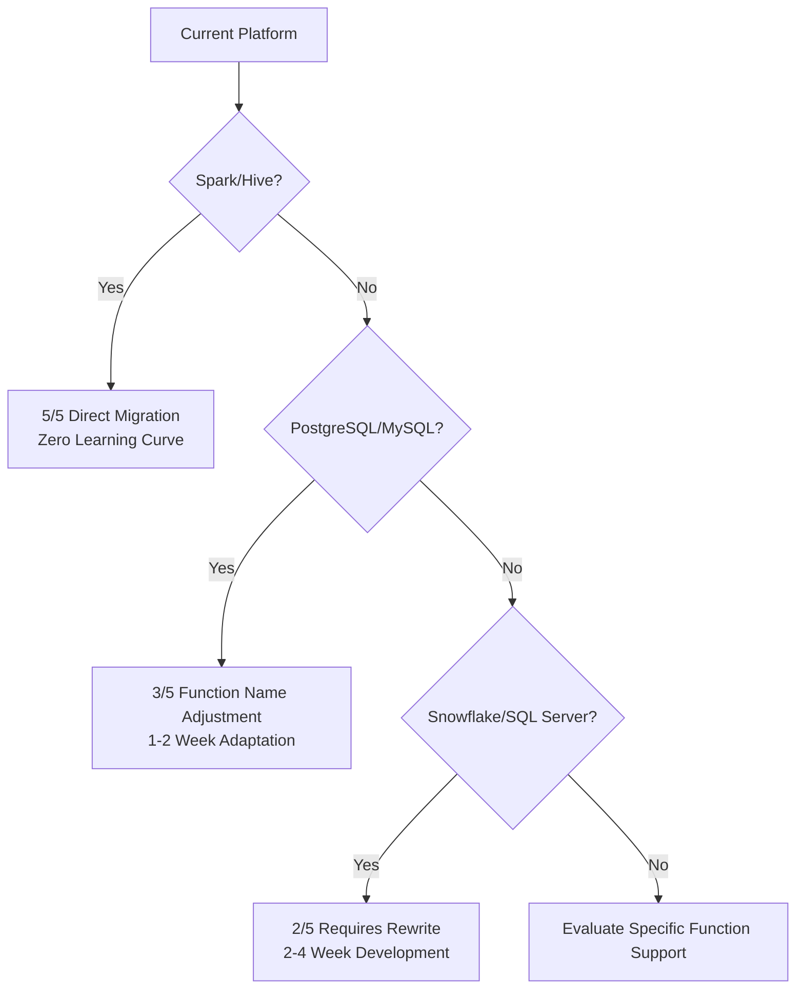

# Lakehouse JSON Data Processing Guide

## Introduction

This guide is based on practical validation testing on the Singdata Lakehouse platform, providing data engineers and developers with a comprehensive guide to working with JSON data types. Whether you are migrating from traditional relational databases or transitioning from big data platforms such as Spark, Hive, Snowflake, or Databricks, you will find best practices and pitfalls to avoid here.

JSON is a core feature of the Singdata Lakehouse for handling semi-structured data. Compared to traditional string-based storage, it offers higher query performance, smarter storage optimization, and richer data manipulation capabilities.

## Quick Navigation

### Get Started

* [JSON Data Type Overview](#json-data-type-overview) - Understand core concepts
* [Basic Syntax](#basic-syntax) - Get started in 5 minutes
* [Function Reference Table](#function-reference-table) - Quickly find the right function
* [Validation Checklist](#validation-checklist) - Ensure correct implementation

### Cross-Platform Support

* [Compatibility Overview](#compatibility-overview) - Understand platform support
* [Spark/Hive Users](#apache-sparkhive-users) - Zero learning curve migration
* [Snowflake Users](#snowflake-users) - Rewrite guidance
* [PostgreSQL/MySQL Users](#postgresqlmysql-users) - Syntax adaptation guide

### Core Features

* [JSON vs STRING](#json-vs-string-comparison) - Choose the right data type
* [Complete JSON Function Guide](#complete-json-function-guide) - Master all JSON operations
* [JSON and Generated Columns](#json-and-generated-columns) - Automated derived field computation
* [Performance Optimization](#performance-optimization) - Achieve optimal query performance

### Troubleshooting

* [Common Errors](#common-errors) - Quick problem resolution
* [Limitations and Considerations](#limitations-and-considerations) - Avoid design pitfalls
* [Migration Guide](#migration-guide) - Phased migration strategy

***

## JSON Data Type Overview

### Core Advantages

The JSON type in Singdata Lakehouse offers significant advantages over string-based storage:

1. **Query performance improvement**: JSON columns support column pruning, reading only the required fields, achieving up to 40x performance improvement
2. **Smart storage optimization**: High-frequency fields are automatically stored in columnar format; low-frequency fields use compact JSON storage
3. **Automatic type inference**: Numbers are first parsed as bigint, and automatically converted to double when out of range
4. **Native function support**: Rich json_extract_* function family with type-safe conversions

### Data Storage Mechanism

```sql
-- Singdata Lakehouse automatically optimizes storage strategy
CREATE TABLE user_profiles (
    id INT,
    profile JSON  -- Smart storage: high-frequency fields in columnar, low-frequency as JSON
);

-- Internal optimization example:
-- High-frequency fields like id, name are automatically stored in columnar format
-- Low-frequency fields like extra_metadata remain in JSON structure
INSERT INTO user_profiles VALUES 
(1, parse_json('{"id": 1, "name": "Zhang San", "age": 30, "extra_metadata": {"hobby": "basketball"}}')),
(2, parse_json('{"id": 2, "name": "Li Si", "age": 25, "city": "Shanghai"}}')),
(3, parse_json('{"id": 3, "name": "Wang Wu", "age": 35, "department": "Engineering"}}'));
```

***

## Compatibility Overview

### Platform Compatibility Ratings

| Platform         | Compatibility Level  | Key Differences                    | Migration Difficulty |
| ---------------- | -------------------- | ---------------------------------- | -------------------- |
| **Apache Spark** | 5/5 Excellent        | Almost fully compatible            | Easy                 |
| **Apache Hive**  | 5/5 Excellent        | Identical function names           | Easy                 |
| **Databricks**   | 4/5 Good             | Spark-compatible, some Delta features need adjustment | Medium |
| **PostgreSQL**   | 3/5 Moderate         | Different operators and function names | Medium            |
| **MySQL**        | 3/5 Moderate         | Function signature differences     | Medium               |
| **Snowflake**    | 2/5 Needs Adaptation | Proprietary functions not supported | Complex             |
| **SQL Server**   | 2/5 Needs Adaptation | JSON functions completely different | Complex            |

### Decision Tree: Choosing the Best Migration Path



***

## Basic Syntax

### Creating JSON Tables

```sql
-- Basic JSON table structure
CREATE TABLE json_example (
    id INT,
    data JSON,           -- Native JSON type
    data_str STRING      -- String-form JSON (for comparison)
);
```

### Inserting JSON Data

```sql
-- Method 1: Using parse_json function (recommended)
INSERT INTO json_example VALUES (
    1, 
    parse_json('{"name": "Zhang San", "age": 30, "city": "Beijing"}'),
    '{"name": "Zhang San", "age": 30, "city": "Beijing"}'
);

-- Method 2: Using json_object to construct
INSERT INTO json_example VALUES (
    2,
    json_object('name', 'Li Si', 'age', 25, 'hobbies', json_array('basketball', 'travel')),
    null
);

-- Method 3: Using JSON literal directly
INSERT INTO json_example VALUES (
    3,
    json'{"name": "Wang Wu", "age": 35, "address": {"city": "Shanghai", "zipcode": "200000"}}',
    null
);
```

***

## JSON vs STRING Comparison

### Performance Comparison (Official Test Data)

Based on Singdata Lakehouse official tests on 10 million records:

| Operation Type      | STRING Storage | JSON Storage | Performance Gain      |
| ------------------- | -------------- | ------------ | --------------------- |
| Field filter query  | 20.4 seconds   | 531 ms       | **38x**               |
| Data scanned        | 454 MB         | 153 MB       | **66% reduction**     |
| Storage space       | 100%           | ~80%         | **20% savings**       |

### Function Usage Differences

```sql
-- Incorrect: Using STRING functions on JSON type
SELECT get_json_object(json_column, '$.name') FROM table_with_json;
-- Error: function 'get_json_object' cannot be resolved, invalid type 'json'

-- Correct: JSON type uses json_extract_* series
SELECT json_extract_string(json_column, '$.name') FROM table_with_json;

-- Correct: STRING type uses get_json_object
SELECT get_json_object(string_column, '$.name') FROM table_with_string;
```

***

## Function Reference Table

### General Function Categories

| Category              | JSON Type Function                   | STRING Type Function                              | Description          |
| --------------------- | ------------------------------------ | ------------------------------------------------- | -------------------- |
| **String Extraction** | `json_extract_string(json, path)`    | `get_json_object(str, path)`                      | Extract as string    |
| **Numeric Extraction**| `json_extract_int(json, path)`       | `cast(get_json_object(str, path) as int)`         | Extract as integer   |
| **JSON Extraction**   | `json_extract(json, path)`           | `get_json_object(str, path)`                      | Keep JSON format     |
| **Boolean Extraction**| `json_extract_boolean(json, path)`   | `cast(get_json_object(str, path) as boolean)`     | Extract as boolean   |
| **Validation**        | `json_valid()`                       | `json_valid()`                                    | Validate JSON format |

### Cross-Platform Function Mapping

#### Spark/Hive to Singdata Lakehouse (5/5 Compatible)

| Spark/Hive Function           | Singdata Lakehouse Function  | Compatibility |
| ----------------------------- | ---------------------------- | ------------- |
| `get_json_object(str, path)`  | `get_json_object(str, path)` | Identical     |
| `json_tuple(str, k1, k2)`     | `json_tuple(str, k1, k2)`    | Identical     |
| `to_json(map(...))`           | `to_json(map(...))`          | Identical     |
| `from_json(str, schema)`      | `from_json(str, schema)`     | Identical     |
| `collect_list(col)`           | `collect_list(col)`          | Identical     |

#### Snowflake to Singdata Lakehouse (2/5 Needs Adaptation)

| Snowflake Syntax              | Singdata Lakehouse Equivalent                | Description         |
| ----------------------------- | -------------------------------------------- | ------------------- |
| `OBJECT_CONSTRUCT('k', 'v')`  | `json_object('k', 'v')`                      | Build JSON object   |
| `ARRAY_CONSTRUCT(1,2,3)`      | `json_array(1,2,3)`                          | Build JSON array    |
| `json_col:field`              | `json_extract_string(json_col, '$.field')`   | Field access        |
| `json_col[0]`                 | `json_extract(json_col, '$[0]')`             | Array index         |
| `FLATTEN(json_col)`           | `LATERAL VIEW explode(...)`                  | Array expansion     |

#### PostgreSQL to Singdata Lakehouse (3/5 Moderate)

| PostgreSQL Syntax         | Singdata Lakehouse Equivalent                | Description                |
| ------------------------- | -------------------------------------------- | -------------------------- |
| `json_col -> 'field'`     | `json_extract(json_col, '$.field')`          | Returns JSON               |
| `json_col ->> 'field'`    | `json_extract_string(json_col, '$.field')`   | Returns string             |
| `json_col #> '{a,b}'`     | `json_extract(json_col, '$.a.b')`            | Path access                |
| `json_col #>> '{a,b}'`    | `json_extract_string(json_col, '$.a.b')`     | Path access returns string |

#### MySQL to Singdata Lakehouse (3/5 Moderate)

| MySQL Function                    | Singdata Lakehouse Function                | Key Difference     |
| --------------------------------- | ------------------------------------------ | ------------------ |
| `JSON_EXTRACT(json_str, path)`    | `json_extract(json_obj, path)`             | Parameter type differs |
| `json_str->'$.field'`             | `json_extract(json_obj, '$.field')`        | Operator vs function |
| `json_str->>'$.field'`            | `json_extract_string(json_obj, '$.field')` | Operator vs function |
| `JSON_OBJECT('k','v')`            | `json_object('k','v')`                     | Identical          |

### Complete JSON_EXTRACT Function Family

```sql
-- Basic extraction (returns JSON format)
json_extract(json_data, '$.field')

-- Type-safe extraction
json_extract_string(json_data, '$.name')        -- String
json_extract_int(json_data, '$.age')            -- Integer
json_extract_bigint(json_data, '$.id')          -- Big integer
json_extract_float(json_data, '$.score')        -- Float
json_extract_double(json_data, '$.price')       -- Double
json_extract_boolean(json_data, '$.active')     -- Boolean
json_extract_date(json_data, '$.birth_date')    -- Date
json_extract_timestamp(json_data, '$.created')  -- Timestamp
```

***

## Platform-Specific Migration Guides

### Apache Spark/Hive Users (5/5 Excellent)

**Compatibility: Nearly perfect! Zero learning curve!**

#### Fully Supported Features

```sql
-- 1. Spark-style JSON construction and parsing
SELECT 
    to_json(map('name', 'Zhang San', 'age', 30)) as spark_json,
    from_json('{"name":"Zhang San","age":30}', 'name STRING, age INT') as spark_struct;

-- 2. collect_list aggregation (Spark user favorite)
SELECT 
    department,
    collect_list(name) as employee_names
FROM employee_json
GROUP BY department;

-- 3. explode to expand JSON arrays
SELECT 
    id,
    hobby
FROM json_table 
LATERAL VIEW explode(split(regexp_replace(
    json_extract_string(json_data, '$.hobbies'), '[\\[\\]"]', ''), ',')) t AS hobby;

-- 4. Window functions fully supported
SELECT 
    name,
    salary,
    row_number() OVER (PARTITION BY department ORDER BY salary DESC) as rank
FROM employee_json;

-- 5. Hive json_tuple fully compatible
SELECT 
    name, age, city
FROM (
    SELECT json_tuple(json_string, 'name', 'age', 'city') as (name, age, city)
    FROM hive_json_table
) t;
```

#### Spark/Hive User Best Practices

```sql
-- Recommended migration pattern
CREATE TABLE lakehouse_events (
    event_id STRING,
    event_data JSON,
    
    -- Generated columns: familiar field extraction
    event_type STRING GENERATED ALWAYS AS (json_extract_string(event_data, '$.type')),
    user_id STRING GENERATED ALWAYS AS (json_extract_string(event_data, '$.user_id')),
    timestamp_col TIMESTAMP GENERATED ALWAYS AS (
        cast(json_extract_string(event_data, '$.timestamp') as timestamp)
    )
) PARTITIONED BY (event_type);

-- Copy Hive queries directly, no modification needed!
CREATE TABLE lakehouse_table AS 
SELECT 
    get_json_object(json_col, '$.user.id') as user_id,
    get_json_object(json_col, '$.user.name') as user_name,
    get_json_object(json_col, '$.event.type') as event_type
FROM source_table
WHERE get_json_object(json_col, '$.event.type') = 'purchase';
```

### Snowflake Users (2/5 Needs Adaptation)

**Compatibility: Requires rewriting, but clear alternatives exist**

#### Snowflake Migration Examples

```sql
-- Snowflake original query (commented out)
-- SELECT 
--     user_data:name::STRING as name,
--     user_data:age::INTEGER as age,
--     user_data:hobbies[0]::STRING as first_hobby
-- FROM snowflake_table;

-- Singdata Lakehouse equivalent
SELECT 
    json_extract_string(user_data, '$.name') as name,
    json_extract_int(user_data, '$.age') as age,
    json_extract_string(user_data, '$.hobbies[0]') as first_hobby
FROM lakehouse_table;

-- Snowflake FLATTEN (commented out)
-- SELECT 
--     value::STRING as hobby
-- FROM snowflake_table,
-- LATERAL FLATTEN(input => user_data:hobbies);

-- Singdata Lakehouse equivalent
SELECT 
    trim(hobby) as hobby
FROM lakehouse_table 
LATERAL VIEW explode(
    split(regexp_replace(json_extract_string(user_data, '$.hobbies'), '[\\[\\]"]', ''), ',')
) t AS hobby;
```

### PostgreSQL/MySQL Users (3/5 Moderate)

**Compatibility: Different functions, same logic**

#### PostgreSQL Migration Examples

```sql
-- PostgreSQL original query (commented out)
-- SELECT 
--     user_data ->> 'name' as name,
--     (user_data -> 'address' ->> 'city') as city,
--     user_data #>> '{preferences,0}' as first_pref
-- FROM postgres_table;

-- Singdata Lakehouse equivalent
SELECT 
    json_extract_string(user_data, '$.name') as name,
    json_extract_string(user_data, '$.address.city') as city,
    json_extract_string(user_data, '$.preferences[0]') as first_pref
FROM lakehouse_table;
```

#### MySQL Migration Notes

```sql
-- MySQL approach (for strings) - commented out
-- SELECT JSON_EXTRACT(json_string, '$.name') FROM mysql_table;

-- Singdata Lakehouse approach (type-aware)
-- For STRING type
SELECT get_json_object(json_string, '$.name') FROM lakehouse_table;

-- For JSON type  
SELECT json_extract_string(json_data, '$.name') FROM lakehouse_table;
```

***

## Complete JSON Function Guide

### 1. JSON Construction Functions

```sql
-- json_object: Build JSON objects
SELECT json_object() as empty_obj;                    -- {}
SELECT json_object('key', 'value') as simple_obj;     -- {"key":"value"}
SELECT json_object(
    'name', 'Zhang San',
    'age', 30,
    'hobbies', json_array('basketball', 'travel')
) as complex_obj;
-- {"age":30,"hobbies":["basketball","travel"],"name":"Zhang San"}

-- json_array: Build JSON arrays
SELECT json_array() as empty_arr;                     -- []
SELECT json_array(1, 2, 3) as number_arr;             -- [1,2,3]
SELECT json_array('a', 'b', 'c') as string_arr;       -- ["a","b","c"]
SELECT json_array(1, 'test', true, null) as mixed_arr; -- [1,"test",true,null]
```

### 2. JSON Path Syntax

```sql
-- Basic path syntax
'$'                    -- Root element
'$.field'              -- Object field
'$.nested.field'       -- Nested object field
'$[0]'                 -- First array element
'$[*]'                 -- All array elements
'$.array[0].field'     -- Field of array element
'$["key.with.dot"]'    -- Keys with special characters (use single quotes)

-- Practical examples
SELECT 
    json_extract_string(data, '$.name') as name,
    json_extract_string(data, '$.address.city') as city,
    json_extract_string(data, '$.hobbies[0]') as first_hobby,
    json_extract(data, '$.hobbies[*]') as all_hobbies
FROM json_table;
```

### 3. JSON Validation and Error Handling

```sql
-- json_valid: Validate JSON format
SELECT 
    json_valid('{"name": "test"}') as valid,      -- true
    json_valid('invalid json') as invalid,       -- false
    json_valid('null') as null_valid,             -- true
    json_valid('[]') as array_valid,              -- true
    json_valid('{}') as object_valid;             -- true

-- Error handling: nonexistent fields return null
SELECT 
    json_extract_string(data, '$.nonexistent') as result  -- Returns null
FROM json_table;
```

***

## JSON and Generated Columns

### Basic Usage

```sql
-- Create a table with JSON generated columns
CREATE TABLE user_analytics (
    id INT,
    user_data JSON,
    -- Generated columns: automatic JSON field extraction
    user_name STRING GENERATED ALWAYS AS (
        json_extract_string(user_data, '$.name')
    ),
    user_age INT GENERATED ALWAYS AS (
        json_extract_int(user_data, '$.age')
    ),
    city STRING GENERATED ALWAYS AS (
        json_extract_string(user_data, '$.address.city')
    )
) COMMENT 'JSON automatic field extraction example';

-- Insert data: only provide the base JSON
INSERT INTO user_analytics (id, user_data) VALUES (
    1, 
    parse_json('{"name": "Zhang San", "age": 30, "address": {"city": "Beijing", "zipcode": "100000"}}')
);

-- Query result: automatically includes extracted fields
SELECT * FROM user_analytics;
-- Result: id=1, user_name="Zhang San", user_age=30, city="Beijing"
```

### Advanced Generated Column Applications

```sql
-- Complex JSON business logic generated columns
CREATE TABLE order_analysis (
    id INT,
    order_json JSON,
    
    -- Basic field extraction
    customer_name STRING GENERATED ALWAYS AS (
        json_extract_string(order_json, '$.customer.name')
    ),
    order_amount DOUBLE GENERATED ALWAYS AS (
        json_extract_double(order_json, '$.amount')
    ),
    
    -- Business logic generated columns
    amount_level STRING GENERATED ALWAYS AS (
        if(json_extract_double(order_json, '$.amount') >= 1000, 'HIGH',
           if(json_extract_double(order_json, '$.amount') >= 500, 'MEDIUM', 'LOW'))
    ),
    
    -- Array element extraction
    first_product STRING GENERATED ALWAYS AS (
        json_extract_string(order_json, '$.products[0].name')
    ),
    
    -- Time dimension generated columns
    order_date STRING GENERATED ALWAYS AS (
        json_extract_string(order_json, '$.order_time')
    )
) PARTITIONED BY (order_date);
```

***

## Validation Checklist

### Post-Creation Validation (Required Every Time)

```sql
-- 1. Create table with generated columns
CREATE TABLE orders_test (
    order_id INT,
    order_time TIMESTAMP_LTZ,
    order_json JSON,
    hour_col INT GENERATED ALWAYS AS (json_extract_int(order_json, '$.hour')),
    date_str STRING GENERATED ALWAYS AS (json_extract_string(order_json, '$.date'))
);

-- 2. Verify table structure
DESCRIBE TABLE orders_test;
-- Check: Do generated columns appear in the table structure?

-- 3. Test data insertion
INSERT INTO orders_test (order_id, order_time, order_json) VALUES 
(1001, TIMESTAMP '2024-06-19 14:30:00', parse_json('{"hour": 14, "date": "2024-06-19"}'));

-- 4. Verify generated column values
SELECT order_id, hour_col, date_str FROM orders_test;
-- Check: hour_col=14, date_str='2024-06-19'

-- 5. Verify insert protection mechanism
-- INSERT INTO orders_test (order_id, order_json, hour_col) VALUES 
-- (1002, parse_json('{"hour": 15}'), 999);
-- Check: Should error "cannot insert or update generated column"
```

### Cross-Platform Compatibility Validation

```sql
-- 6. Verify function compatibility
SELECT 
    -- Hive/Spark style (should work)
    get_json_object('{"name":"test"}', '$.name') as hive_style,
    
    -- JSON type functions (should work)
    json_extract_string(parse_json('{"name":"test"}'), '$.name') as json_style,
    
    -- Aggregate functions (should work)
    collect_list('test') as spark_aggregate;

-- 7. Verify performance differences
-- Compare query performance: JSON type vs STRING type
EXPLAIN SELECT json_extract_string(json_col, '$.field') FROM json_table;
EXPLAIN SELECT get_json_object(string_col, '$.field') FROM string_table;
```

***

## Performance Optimization

### 1. Storage Optimization Strategies

```sql
-- High-frequency field optimization: let the system auto-identify and optimize storage
CREATE TABLE optimized_storage AS 
SELECT parse_json(json_string) as optimized_json 
FROM VALUES 
    ('{"id": 1, "name": "Zhang San", "frequent_field": "value1"}'),
    ('{"id": 2, "name": "Li Si", "frequent_field": "value2"}'),
    ('{"id": 3, "name": "Wang Wu", "frequent_field": "value3", "rare_field": "rare"}')
as t(json_string);

-- The system will automatically store id, name, frequent_field in columnar format
-- rare_field remains in JSON storage, avoiding sparse columns
```

### 2. Query Optimization

```sql
-- High-performance: Use JSON type + correct functions
SELECT 
    json_extract_string(json_data, '$.name'),
    json_extract_int(json_data, '$.age')
FROM json_table 
WHERE json_extract_string(json_data, '$.city') = 'Beijing';

-- Low-performance: Using STRING type requires full table scan
SELECT 
    get_json_object(string_data, '$.name'),
    get_json_object(string_data, '$.age')
FROM string_table 
WHERE get_json_object(string_data, '$.city') = 'Beijing';
```

### 3. Universal High-Performance Pattern

```sql
-- High-performance pattern: JSON + Generated Columns + Indexes
CREATE TABLE optimized_json (
    id BIGINT,
    raw_data JSON,
    
    -- Generated columns for hot fields
    user_id STRING GENERATED ALWAYS AS (json_extract_string(raw_data, '$.user_id')),
    timestamp_col TIMESTAMP GENERATED ALWAYS AS (
        cast(json_extract_string(raw_data, '$.timestamp') as timestamp)
    ),
    event_type STRING GENERATED ALWAYS AS (json_extract_string(raw_data, '$.event_type'))
) PARTITIONED BY (event_type);

-- Create indexes on generated columns
CREATE INDEX idx_user_id ON optimized_json (user_id);
CREATE INDEX idx_timestamp ON optimized_json (timestamp_col);
```

***

## Limitations and Considerations

### 1. JSON Type Limitations (General)

```sql
-- Unsupported operations

-- Comparison operations
SELECT * FROM json_table WHERE json_col = parse_json('{"key": "value"}');
-- Error: operator not found, json = json

-- Sort operations
SELECT * FROM json_table ORDER BY json_col;
-- Error: require equality comparable type in ORDER BY, but got json

-- Group operations
SELECT json_col, COUNT(*) FROM json_table GROUP BY json_col;
-- Error: GROUP BY not supported on JSON type

-- As JOIN key
SELECT * FROM table1 t1 JOIN table2 t2 ON t1.json_col = t2.json_col;
-- Error: JSON type not supported as JOIN key
```

### 2. Partition and Index Limitations

```sql
-- Not supported as partition key
CREATE TABLE partitioned_table (
    id INT,
    data JSON
) PARTITIONED BY (data);  -- Error: JSON not supported as partition key

-- Correct approach: Use generated columns as partition keys
CREATE TABLE partitioned_correct (
    id INT,
    data JSON,
    date_part STRING GENERATED ALWAYS AS (json_extract_string(data, '$.date'))
) PARTITIONED BY (date_part);
```

### 3. Path Syntax Limitations

```sql
-- Unsupported path syntax
-- Negative index: '$[-1]'
-- Conditional filtering: '$[?(@.price > 10)]'
-- Recursive descent: '$..'

-- Supported path syntax
'$.field'              -- Field access
'$.nested.field'       -- Nested fields
'$[0]'                 -- Array index
'$[*]'                 -- All array elements
'$["field.with.dot"]'  -- Special character fields (single quotes)
```

***

## Common Errors

### 1. Function Type Errors

| Error Symptom                                                                 | Cause                            | Solution                        |
| ----------------------------------------------------------------------------- | -------------------------------- | ------------------------------- |
| `function 'get_json_object' cannot be resolved, invalid type 'json'`          | Using STRING function on JSON type | Use `json_extract_string()`     |
| `function 'json_extract_string' cannot be resolved, invalid type 'string'`    | Using JSON function on STRING type | Use `get_json_object()`         |
| `operator not found, json = json`                                             | Attempting to compare JSON values  | Extract and compare as base type |

### 2. Path Syntax Errors

```sql
-- Incorrect path syntax
json_extract_string(data, 'name')           -- Missing $ prefix
json_extract_string(data, '$.key.with.dot') -- Special characters need brackets

-- Correct path syntax
json_extract_string(data, '$.name')
json_extract_string(data, '$["key.with.dot"]')  -- Note: use single quotes
```

### 3. Platform Migration Common Errors

```sql
-- Snowflake user common mistake (commented out)
-- SELECT user_data:name FROM table;  -- : operator not supported

-- PostgreSQL user common mistake (commented out)
-- SELECT user_data->'name' FROM table;  -- -> operator not supported

-- MySQL user common mistake (commented out)
-- SELECT JSON_EXTRACT(json_data, '$.name') FROM table;  -- Parameter type error

-- Unified correct syntax
SELECT json_extract_string(user_data, '$.name') FROM table;  -- JSON type
SELECT get_json_object(user_string, '$.name') FROM table;    -- STRING type
```

***

## Migration Guide

### Phased Migration Strategy

#### Phase 1: Assessment and Preparation (1-2 weeks)

```sql
-- 1. Assess current JSON usage
SELECT 
    table_name,
    column_name,
    data_type,
    count(*) as usage_count
FROM information_schema.columns 
WHERE data_type LIKE '%json%' OR column_name LIKE '%json%'
GROUP BY table_name, column_name, data_type;

-- 2. Identify high-frequency JSON operations
-- Analyze JSON function usage in existing queries
```

#### Phase 2: Compatibility Testing (1-2 weeks)

```sql
-- 3. Create test tables to verify compatibility
CREATE TABLE migration_test (
    id INT,
    old_json_string STRING,     -- Keep original format
    new_json_data JSON,         -- New JSON type
    -- Dual generated columns for validation
    field_old STRING GENERATED ALWAYS AS (get_json_object(old_json_string, '$.field')),
    field_new STRING GENERATED ALWAYS AS (json_extract_string(new_json_data, '$.field'))
);

-- 4. Performance baseline testing
-- Compare performance between old and new queries
```

#### Phase 3: Incremental Migration (2-4 weeks)

```sql
-- 5. New tables directly use JSON type
CREATE TABLE new_design_table (
    id INT,
    data JSON,
    -- Key field generated columns
    user_id STRING GENERATED ALWAYS AS (json_extract_string(data, '$.user_id')),
    event_type STRING GENERATED ALWAYS AS (json_extract_string(data, '$.event_type'))
) PARTITIONED BY (event_type);

-- 6. Add JSON column to existing tables
ALTER TABLE existing_table ADD COLUMN 
json_data JSON GENERATED ALWAYS AS (parse_json(json_string));
```

#### Phase 4: Full Migration (based on business windows)

```sql
-- 7. Update application code
-- Switch all JSON operations to new functions and columns

-- 8. Clean up old columns (after confirming stability)
-- ALTER TABLE table_name DROP COLUMN old_json_string;
```

***

## Best Practices Summary

### 1. Design Principles

1. **Type Selection**: Prefer JSON type over STRING for storing semi-structured data
2. **Field Extraction**: Create generated columns for commonly used fields to improve query performance
3. **Index Strategy**: Create indexes on generated columns, not raw JSON columns
4. **Partition Design**: Use generated columns as partition keys to support time-based partitioning

### 2. Platform Adaptation Strategies

* **Spark/Hive users**: Almost no learning needed, direct migration
* **Snowflake users**: Focus on function mapping, gradually rewrite queries
* **PostgreSQL/MySQL users**: Focus on adapting to function name differences
* **New users**: Learn Singdata Lakehouse JSON best practices directly

### 3. Performance Optimization Checklist

* [ ] Use JSON type instead of STRING type
* [ ] Create generated columns for high-frequency query fields
* [ ] Create appropriate indexes on generated columns
* [ ] Use generated columns for partitioning
* [ ] Regularly monitor query performance and storage efficiency

### 4. Migration Checklist

#### Pre-Migration Assessment

* [ ] Identify currently used JSON functions and operators
* [ ] Assess data types (STRING vs JSON)
* [ ] Determine performance-critical paths
* [ ] Develop a phased migration plan

#### Syntax Conversion

* [ ] Function name mapping completed
* [ ] Path syntax validation
* [ ] Error handling mechanism adjusted
* [ ] Performance optimization points identified

#### Test Validation

* [ ] Functional equivalence testing
* [ ] Performance baseline testing
* [ ] Edge case validation
* [ ] Error handling testing

#### Launch Preparation

* [ ] Rollback plan prepared
* [ ] Monitoring metrics configured
* [ ] Team training completed
* [ ] Documentation updated

***

## Summary

### Core Value

1. **Significant performance improvement**: Up to 40x query performance improvement compared to STRING storage
2. **Cross-platform compatibility**: Zero learning curve for Spark/Hive users, clear migration paths for other platforms
3. **Smart storage optimization**: Columnar storage for high-frequency fields, compact JSON storage for low-frequency fields
4. **Improved development efficiency**: Rich type-safe functions, automated field extraction
5. **Simplified architecture**: Unified semi-structured data processing solution

### Key Takeaways

**Platform selection guidance**:

* **Spark/Hive users**: Direct migration, enjoy the performance gains.
* **Snowflake/SQL Server users**: Invest in rewriting for long-term benefits.
* **PostgreSQL/MySQL users**: Moderate learning cost, significant performance benefits.

**JSON vs STRING selection**:
JSON type provides better performance and capabilities and should be the preferred choice. Only consider STRING storage when compatibility with legacy systems is required or in special scenarios.

**Function selection key points**:
Remember the core rule: use `json_extract_*` series for JSON type, `get_json_object` for STRING type. Type mismatch is the most common error.

**Generated column design**:
The combination of JSON and generated columns is a powerful feature of the Singdata Lakehouse, automating complex field extraction logic and significantly improving development efficiency.

By using JSON features correctly, you will achieve higher query performance, better storage efficiency, and cleaner code architecture. Regardless of your source platform, you can fully leverage the powerful JSON capabilities in the Singdata Lakehouse!

***

**Note**: This document is based on the Lakehouse product documentation from June 2025. It is recommended to check the official documentation regularly for the latest updates. Before using in production, always validate all operations for correctness and performance impact in a test environment.
