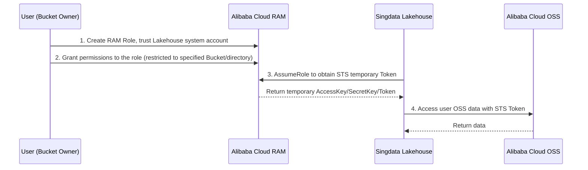

# BYOS (Bring Your Own Storage) Configuration Guide via RAM Role

> **[Preview Release]** This feature is currently in an invite-only preview release stage. If you need access, please contact our technical support team for assistance.

BYOS (Bring Your Own Storage) allows enterprise customers to keep their data in their own object storage (such as Alibaba Cloud OSS) while delegating only compute tasks to Singdata Lakehouse.

This document describes how to implement a more secure BYOS configuration using **Alibaba Cloud RAM Roles**. Compared to directly granting Bucket access, the RAM Role approach offers the following advantages:

- **Data sovereignty and security**: Data always remains in the customer's Bucket. Access Control via RAM Role strictly controls Lakehouse's access permissions, preventing data from being locked into cloud vendor private storage.
- **Complete compute-storage separation**: Lakehouse does not hold data; it only provides a powerful SQL and AI compute engine.
- **Least-privilege access**: Via STS temporary authorization (AssumeRole), Lakehouse only obtains access permissions during task execution, and permissions expire when the task ends.
- **No AccessKey management required**: Based on the role trust chain, no long-lived AK/SK needs to be configured in Lakehouse, reducing the risk of key leakage.

---

## 1. Architecture Overview

The core of BYOS is a trust chain based on Alibaba Cloud RAM Roles. Once configured, Lakehouse will access your OSS data by assuming the RAM Role you created.



---

## 2. Prerequisites

Before starting the configuration, make sure you have the following information ready:

| Item | Description | How to Obtain |
|--------|------|----------|
| **Lakehouse System Account ID** | The primary account ID of Singdata Lakehouse on Alibaba Cloud | Contact technical support (e.g., `1384322691904283`) |
| **OSS Bucket Name** | The storage bucket dedicated to Lakehouse | Alibaba Cloud OSS Console |
| **Bucket Region** | Must be in the same Region as the Lakehouse instance | Alibaba Cloud OSS Console |
| **Storage Path (optional)** | Subdirectory under the Bucket, e.g., `byos/singdata` | Plan as needed |

> ⚠️ **Important**: The OSS Bucket must be in the **same cloud vendor and same Region** as the Lakehouse instance, otherwise cross-region traffic charges may apply and access may fail.

---

## 3. User-Side Operations (Bucket Owner)

You need to log in to your own Alibaba Cloud console and create a "trusted role" for Lakehouse.

### Step 1: Create a RAM Role

1. Log in to [Alibaba Cloud RAM Console](https://ram.console.aliyun.com).
2. In the left navigation bar, select **Identity Management** > **Roles**, then click **Create Role**.
3. **Select trusted entity type**: Select **Alibaba Cloud Account**.
4. **Select trusted cloud account**: Select **Other Cloud Account** and enter the Lakehouse system account ID (e.g., `1384322691904283`).
5. **Role name**: It is recommended to name it `lakehouse-byos-role` or similar for easy identification.
6. Click **Finish**.

### Step 2: Grant Permissions to the Role (Least Privilege Principle)

**Do not grant `AliyunOSSFullAccess`**. It is recommended to create a custom policy that only opens access to the Bucket or directory that Lakehouse needs.

1. In the RAM Console left navigation bar, select **Permission Management** > **Permission Policies**, then click **Create Permission Policy**.
2. Select the **Script Edit** tab, paste the following policy template, and replace `bucket_name` and `path` with actual values:

```json
{
  "Version": "1",
  "Statement": [
    {
      "Effect": "Allow",
      "Action": [
        "oss:GetObject",
        "oss:PutObject",
        "oss:DeleteObject",
        "oss:ListObjects",
        "oss:GetBucketInfo",
        "oss:GetBucketLocation"
      ],
      "Resource": [
        "acs:oss:*:*:bucket_name",
        "acs:oss:*:*:bucket_name/path/*"
      ]
    }
  ]
}
```

**Parameter descriptions**:

| Field | Description | Example |
|------|------|------|
| `bucket_name` | Your OSS Bucket name | `my-company-data-bucket` |
| `path` | The subdirectory path used by Lakehouse | `byos/singdata` |

> Why are these permissions needed?
> * `GetObject/PutObject/DeleteObject`: Read, write, and clean up data
> * `ListObjects`: List files in a directory
> * `GetBucketInfo/GetBucketLocation`: Verify Bucket configuration and region

3. Fill in the policy name (e.g., `LakehouseBYOSAccess`) and description, then click **OK**.
4. Go back to the **Roles** list, find the `lakehouse-byos-role` you just created, click **Grant Permissions**, and assign the policy created in the previous step to this role.

### Step 3: Obtain the RoleARN

1. In the role list, click `lakehouse-byos-role` to enter the detail page.
2. Copy the **Role ARN**, in the following format:
   ```
   acs:ram::1487081375239592:role/lakehouse-byos-role
   ```
   > Here `1487081375239592` is your own Alibaba Cloud primary account ID.

---

## 4. Lakehouse-Side Operations

After completing the Alibaba Cloud configuration, please provide the following information to Singdata technical support, and we will assist you in completing the Lakehouse-side configuration:

| Information to Provide | Example Value |
|------------|--------|
| **Role ARN (RoleARN)** | `acs:ram::1487081375239592:role/lakehouse-byos-role` |
| **Bucket Name** | `my-company-data-bucket` |
| **Storage Path** | `byos/singdata` |
| **Bucket Region** | `cn-beijing` |

After configuration is complete, you can create a new workspace in Lakehouse Studio and select this BYOS storage as the data storage location for the workspace.

---

## 5. Verify Configuration

After configuration is complete, you can verify whether BYOS is working correctly using the following methods:

### Method 1: Test Connectivity in Studio

1. Log in to Lakehouse Studio, go to **Management** > **More** > **Private Storage**.
2. Find the BYOS storage you just configured, and click **Test Connectivity** on the right.
3. If it shows **Success**, the configuration is correct.

### Method 2: Verify via SQL

Execute the following commands in the Lakehouse SQL editor to verify that OSS data can be read and written normally:

```sql
-- 1. Create an external table pointing to the BYOS path
CREATE EXTERNAL TABLE test_byos (
    id INT,
    name STRING
)
LOCATION 'oss://my-company-data-bucket/byos/singdata/test/';

-- 2. Insert test data
INSERT INTO test_byos VALUES (1, 'hello'), (2, 'world');

-- 3. Query to verify
SELECT * FROM test_byos;
```

If the query returns normal results, the BYOS configuration is successful.

---

## 6. Troubleshooting Common Issues

### Q1: Connectivity test fails with "Access Denied" or "SignatureDoesNotMatch"

**Possible causes**:
* RoleARN is incorrect (UID mismatch or role name error).
* The Lakehouse system account ID is not included in the RAM Role's trust policy.
* The Resource path in the permission policy does not match the actual access path.

**Resolution steps**:
1. Check that the RoleARN format is correct: `acs:ram::<your Alibaba Cloud account ID>:role/<role name>`.
2. Check the role's **Trust Policy Management** in the RAM Console to ensure it includes the Lakehouse system account ID.
3. Check whether the `Resource` in the permission policy covers your configured storage path.

### Q2: Job reports "STS Token Expired" at runtime

**Possible causes**:
* The job runtime exceeded the STS Token validity period.

**Resolution steps**:
* Contact technical support to adjust the STS Token validity period (default 1 hour, maximum 12 hours).
* Ensure that `MaxSessionDuration` set in the RAM Role console is not less than the Token validity period.

### Q3: Can an existing workspace be migrated to BYOS?

**No**. The storage location of a workspace cannot be changed once set. To use BYOS, please create a new workspace.

### Q4: Can one Bucket be used by multiple workspaces?

**Yes**. One BYOS configuration can be associated with multiple workspaces. Lakehouse will separate each workspace's data under different sub-paths in the Bucket, without interfering with each other.

---

## Related Documents

- [Private Storage (BYOS) Overview](byos_general.md)
- [Alibaba Cloud Private Storage Configuration (Bucket Authorization Method)](alicloud_byos_configuration.md)
- [Alibaba Cloud RAM Role Documentation](https://help.aliyun.com/zh/ram/user-guide/roles)
- [Alibaba Cloud STS Temporary Authorization](https://help.aliyun.com/zh/sts/user-guide/what-is-sts)
